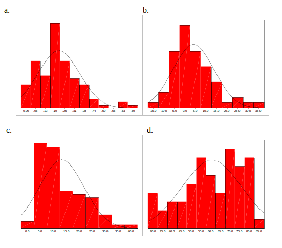

# Introduction


In this practical, we will use several ’read-life’ datasets to demonstrate some of the concepts you have
seen in the lectures. We will guide you through how to analyse these datasets in R and the kinds
of questions you should be asking yourself when faced with similar data. As this is not a course in using R, we will provide the R code that you will need. However, it is up to you to think carefully about the assumptions of a statistics tests and interpret the results that R gives

```{r knitr, echo=FALSE, results="hide"}
library("knitr")
opts_chunk$set(tidy=FALSE,dev="png",fig.show="as.is",
               fig.width=10,fig.height=6,
               message=FALSE,eval=TRUE,warning=FALSE,echo=TRUE)
```


# Choice of Method

1. What type of analysis would you use on the data illustrated below; parametric or non-parametric. Justify your answer.



2. List some situations that suggest the use of non-parametric methods rather than parametric ones.

3. In the following situations which is the appropriate test to perform.  Give reasons for your choice of test.
    a) The daily energy intake over ten days of 11 women is recorded.  The recommended level of energy intake is 7725kJ a day.  Whether the women’s daily intake is 7725kJ is to be tested. 
    b) In a study of the risk of coronary artery surgery to women, the median duration of intubation and median duration of ICU length of stay are to be compared between the two groups older and younger women. 
    c) In a trial to test whether a drug is a diuretic or not there are two treatment arms, placebo and drug.  The daily urine production is measured in both groups.  The amount of urine produced is to be compared between the two groups.
    d) The reaction times of pairs of twins are to be tested.  Each twin in the pair will be randomly assigned to group A or group B.  Group A will remain sober and group B will drink three double whiskies.  After their drinks their reaction times will be tested and compared.  
    e) A study is to be carried out to test whether hormone levels effect how quickly caffeine is eliminated by the body.  There will be three arms to the trial, males, females on the contraceptive pill and females not on the contraceptive pill.  Each subject will be given a tablet that contains 250 mg of caffeine.  The half-life of the caffeine in the blood will then be measured.  These half-lives will then be compared between the three groups.


# One-Way ANOVA

1. Open the file `amess.csv` in R. The data are the red cell folate levels in three groups of cardiac bypass patients given different levels of nitrous oxide (N$_2$O) and oxygen (O$_2$) ventilation. [There is a reference to the source of this data in Altman, Practical Statistics for Medical Research, p. 208.]

The treatments are

i) 50% N2O and 50% O2 continuously for 24 hours
ii) 50% N2O and 50% O2 during the operation
iii) No N2O but 35-50% O2 continuously for 24 hours

```{r}
amess <- read.csv("FromSarah/ANOVA/amess.csv")
```


2. Draw boxplots of the data. Does it look as though the assumptions for ANOVA are satisfied?

```{r}
boxplot(folate~treatmnt,data=amess)
```

3. Perform t-tests for each of the three pair-wise comparisons. Make note of the t-test statistics obtained. Which groups, if any, differ from one another?

```{r}
pairwise.t.test(amess$folate, amess$treatmnt)
```

4. Perform an analysis of variance on the data. Why is this a more valid analysis? Interpret the output.

```{r}
mod <- aov(folate~treatmnt,data=amess)
mod
summary(aov(mod))
```

5. Choose any pair of treatments and repeat the ANOVA for just these two treatments. Compare the test statistic value to the results of the t-test from question 3.

```{r}
subset <- amess[amess$treatmnt != 3,]
t.test(folate~treatmnt,data=subset)
```

6. If the assumptions for ANOVA don’t hold, then there are non-parametric alternatives available. 

    + If the assumption of normality doesn’t hold then we might look at the Kruskal-Wallis test. 
    + If the assumption of equal variances doesn’t hold then we might use the median test.

Perform these tests. Do they give the same answer as ANOVA? If not, why not? How important were the assumptions?


```{r}
kruskal.test(folate~treatmnt,data=amess)

library(RVAideMemoire)
mood.medtest(folate~treatmnt,data=amess)
```

# Breast Cancer Incidence

1. The file `globalBreastCancerRisk.csv` gives the number of new cases of Breast Cancer (per population of 10,000) in various countries around the world, along with various health and lifestyle risk factors. These data were collected from the [gapminder](www.gapminder.org) resource. Let's suppose we are initially interested in whether the number of breast cancer cases is significantly different in different regions of the world.

    a) Read these data into R.
    b) 
```{r}
bcStats <- read.csv("globalBreastCancerRisk.csv")
boxplot(NewCasesOfBreastCancerIn2002~continent,data=bcStats)
```
    


    
# Non-parametric Methods

1.  Dr D. R. Peterson of the Department of Epidemiology, University of Washington, collected the data found in file `np1.sav`.  It consists of the birth-weights of each of 20 dizygous twins.  The hypothesis to be tested is that the SIDS child of each pair has a lower birth-weight.     

  a) Construct the null and alternative hypothesises
  
  b) Decide on the level of significance to be used and whether the test should be one-sided or two-sided.

  c) Carry out both the sign and Wilcoxon signed rank tests on the data.  Do both tests draw the same conclusion about the data?  Which test is the most appropriate?
  
  
```{r}
library(foreign)
twins <- read.spss("FromSarah/NPANOVA/np1.sav")
twins <- data.frame(bw=c(twins$SIDS,twins$NONSIDS), SIDS=rep(c(1,2),each=20))
wilcox.test(bw~SIDS,data=twins,paired=TRUE,alternative="less")
```


2. The file np2.sav contains data on vitamin D levels for subjects with fibrosis.
    a) a. Use the Mann-Whitney U and median tests to compare vitamin D levels between those with and without fibrosis.  Interpret the results from both tests. Do both tests reach the same conclusion?
    b) Which test is the more appropriate?
    c) Use the Kruskal-Wallis test to compare vitamin D levels between the different stages of fibrosis.  Interpret the results of the test.
    
```{r}
vitd <- read.spss("FromSarah/NPANOVA/np2.sav")
boxplot(vitd$VITD~vitd$FIBYN)
wilcox.test(vitd$VITD~vitd$FIBYN)
mood.medtest(vitd$VITD~vitd$FIBYN)
boxplot(vitd$VITD~vitd$FIBROSIS)
kruskal.test(vitd$VITD~vitd$FIBROSIS)
```


